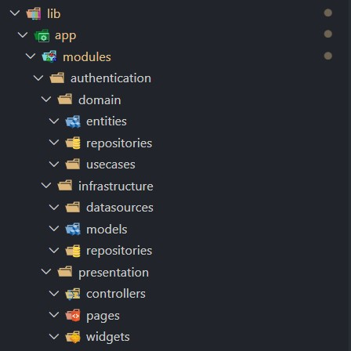

# Clean Architecture Folder Structure extension for VS Code

> ### This extension is foked from [Flutter Module Scaffolding](https://github.com/KiritchoukC/vscode-ext_flutter-clean-architecture) which is based on [felangel](https://github.com/felangel) BLoC extension

## Introduction

Inspired by the [Clean Architecture course](https://resocoder.com/2019/08/27/flutter-tdd-clean-architecture-course-1-explanation-project-structure/) by [ResoCoder](https://github.com/ResoCoder), this extension will help you quickly scaffold a module.

## Directory structure example

For example, let's take the authentication module:

## Installation

This extension can be installed from the [VSCode Marketplace](https://marketplace.visualstudio.com/items?itemName=KiritchoukC.flutter-clean-architecture) or by [searching within VSCode](https://code.visualstudio.com/docs/editor/extension-gallery#_search-for-an-extension).

## New Module Command Usage

You can activate the command by launching the command palette (View -> Command Palette) and running "Flutter Clean Architecture: New Module".

Or you can right click on the directory in which you'd like to create the feature and select the "New Module" command from the context menu.

